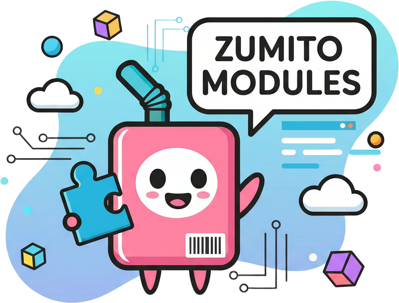

<!-- PROJECT LOGO -->
 

  

  <h3 align="center">Zumito Modules</h3>

  

    Collection of oficial modules to extend zumito-framework functionalities
     
    <a href="https://docs.zumito.dev/"><strong>Explore the modules »</strong></a>
     
     
    <a href="https://github.com/ZumitoTeam/zumito-modules/issues">Report Bug</a>
    ·
    <a href="https://github.com/ZumitoTeam/zumito-modules/issues">Request Feature</a>
  

## Modules

This repository contains the following official modules for the Zumito Framework:

| Module |
|--------|
| **[Admin](admin/)** Administrative panel and management tools, including dashboard, superadmin management, and authentication. |
| **[Canvas Module](canvas-module/)** Utility library for enhanced canvas rendering, image processing, and GIF generation for Discord bots. |
| **[Distube Module](distube-module/)** Music playback integration using DisTube, with commands, user panel, and multi-platform support. |
| **[Logger](logger/)** Logging services and utilities for tracking bot activities and errors. |
| **[Reactions Module](reactions-module/)** Reaction handling and commands for interactive Discord features. |
| **[Stickmanfight](stickmanfight/)** Interactive command for animated stick figure fights using user avatars. |
| **[User Panel](userPanel/)** User-facing dashboard for account management, server lists, and platform interactions. |